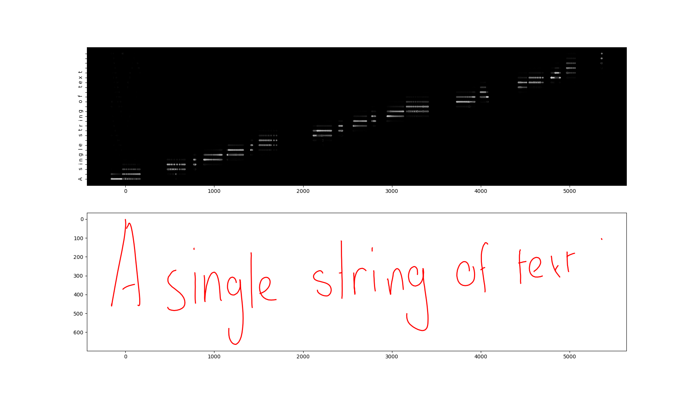
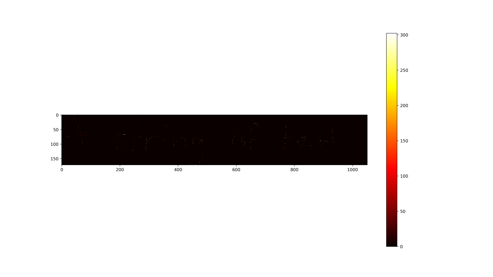
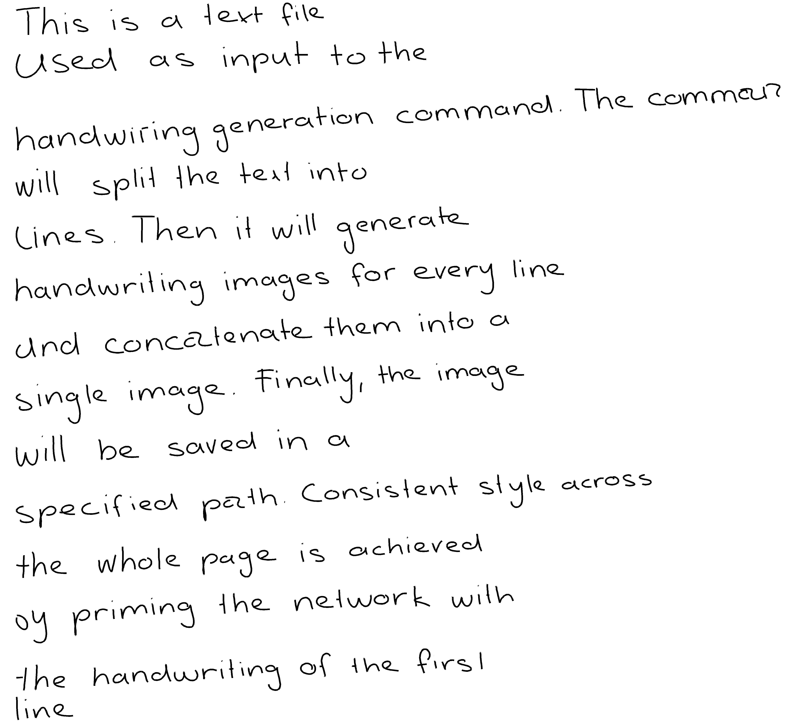
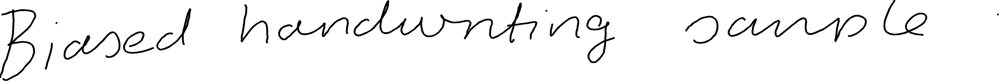

See the demo [here](https://x-raylaser.github.io/pytorch-handwriting-synthesis-toolkit/).

# Introduction

This repository contains utilities for doing handwriting prediction and handwriting synthesis with recurrent neural networks. 
The implementation closely follows Alex Graves's paper 
[Generating Sequences With Recurrent Neural Networks](https://arxiv.org/abs/1308.0850).

It provides a complete working pipeline for training models on a custom dataset and sampling from them.

It includes:
- pre-trained models
- handwriting sampling and synthesis utilities
- data preparation utilities
- training utilities
- synthesis network architecture
- prediction network architecture
- exporting models to ONNX

# Requirements

- Python version 3.7.0 or greater

# Installation
1. Open the terminal in some directory.
2. Clone the repository
```
git clone https://github.com/X-rayLaser/pytorch-handwriting-synthesis-toolkit.git
```

3. Change a current working directory
```
cd pytorch-handwriting-synthesis-toolkit
```
4. Create a virtualenv environment using Python 3
```
virtualenv --python='/path/to/python3/executable' venv
```
On Linux you can find the path to python3 executable using this command:
```
which python3
```
5. Activate the virtual environment
```
. venv/bin/activate
```
6. Install dependencies
```
pip install -r requirements.txt
```

# Pretrained models

Pre-trained models for synthesis and prediction are stored, respectively, under checkpoints/ and ucheckpoints/ directories.

# Handwriting synthesis using pre-trained synthesis network

Create 5 handwriting samples and save them in the "samples" directory 
(If a directory does not exist yet, it will be created)
```
python synthesize.py checkpoints/Epoch_46 'A single string of text  ' -b 1 --samples_dir=samples --trials=5
```


Optional parameter -b specifies a probability bias. 
Higher values result in a cleaner, nicer looking handwriting,
while lower values result in less readable but more diverse samples.
Please, read a corresponding section in the paper for more detail.

By default, bias equals to 0 which corresponds to unbiased sampling. 
Just omit the bias parameter to do so:
```
python synthesize.py checkpoints/Epoch_56 'A single string of text  ' --samples_dir=samples
```


Pass parameter --show_weights to create an attention heatmap
```
python synthesize.py checkpoints/Epoch_52 'A single string of text  ' -b 1 --samples_dir=samples --show_weights
```



Pass parameter --heatmap to create a heatmap of predicted mixture densities
```
python synthesize.py checkpoints/Epoch_52 'A string of text  ' -b 0.5 --samples_dir=samples --heatmap
```




Generate a handwriting page for a text file
```
python txt2script.py checkpoints/Epoch_52 test_document.txt -b 1 --output_path 'handwriting_page.png'
```



# Unconditional sampling using pre-trained prediction network
```
python sample.py ucheckpoints/Epoch_36 usamples --trials 5 -b 0.5
```


# Training from scratch

## Prerequisites

In order to carry out the experiments from the paper, you will need to download 
the IAM On-Line Handwriting Database (or shortly, IAM-OnDB).

It is also possible to work with a custom dataset, but one would require to implement a so-called data provider class
with just 2 methods. More on that is discussed in later sections.

You can obtain the IAM-OnDB dataset from here 
[The IAM On-Line Handwriting Database (IAM-OnDB)](https://fki.tic.heia-fr.ch/databases/iam-on-line-handwriting-database).

Download the data set and unzip it into iam_ondb_home folder. The layout of the folder should be as follows:
```
├── ascii-all
│   └── ascii
├── lineImages-all
│   └── lineImages
├── lineStrokes-all
│   └── lineStrokes
├── original-xml-all
│   └── original
└── original-xml-part
    └── original
```

## Quickstart

Extract data examples from IAM-onDB dataset, preprocess it and save it into "data" directory
(make sure that iam_ondb_home folder is located at the root of the repository):
```
python prepare_data.py data iam 9500 0 iam_ondb_home -l 700
```

After running this command, you should see a new folder called "data" containing 3 files:
```
.
├── charset.txt
├── train.h5
└── val.h5
```

Start training synthesis network for 50 epoch with a batch size 32 (this might take a lot of time, even on GPU).
```
python train.py -b 32 -e 50 -i 300 data checkpoints
```

Create 1 handwriting for the string 'Text to be converted to handwriting'.
```
python synthesize.py checkpoints/Epoch_46 'Text to be converted to handwriting  ' -b 1 --samples_dir=samples --trials=5
```

This section very briefly describes steps needed to train (conditional) synthesis network.
For more details, see dedicated sections below.

## Data preparation
The toolkit already comes with a built-in data preparation utility. 
However, it requires a so-called data provider. If you want to use the IAM-onDB dataset, 
no further action is necessary. Otherwise, you have to write your own to let the toolkit 
know how to extract the data.

Once there is a provider class, the toolkit will automatically preprocess data and save it. 
The preprocessing mainly involves the following steps:
- flattening every raw handwriting into a list of 3-element tuples  
(containing x and y coordinates as well as End-Of-Stroke flag)
- replacing every coordinate with its offset from the previous one
- truncating the sequences longer than a specified threshold

The steps above apply only to the handwriting portion of the data. 
Transcripts remain unchanged.

Data preparation is done by running the command prepare_data.py. 
Executing the script will create two files in HDF5 format, 
1 for training and 1 for validation examples. Along the way, the script also 
computes the mean and standard deviation and extracts all unique characters 
from transcripts.

The command expects at least two arguments: a path to a directory that will 
store prepared data and a name of a data provider. The name must match the 
data provider's name attributes (for example, iam for IAMonDBProvider class).
The data provider class might have __init__ method that takes arguments 
(as is the case with iam provider). If that's the case, you need to pass them 
in when calling the script.

An optional parameter --max_len sets the maximum length of handwriting. 
Any handwriting longer than max_len is going to be truncated to max_len points.

For more details on the command usage, see the Commands section.

## Implementing custom data provider

The data provider is a class with a class attribute "name" and two methods: 
get_training_data and get_validation_data.

Methods have to return an iterable or generator of pairs of examples in a 
certain format. Other than that, these methods can contain any logic whatsoever.

Every example needs to be a tuple of size 2. The second element is a 
corresponding transcript as a Python string. The first element of the 
tuple stores handwriting represented as a list of strokes. A stroke is yet 
another list of tuples (x, y), where x and y are coordinates recorded by a 
pen moving on the screen surface. Here is an example of handwriting consisting 
of 3 strokes:
```
[
    [(1, 2), (1, 3), (2, 5)],
    [(10, 3), (15, 4), (18, 8)],
    [(22, 10), (20, 5)]
]
```

Let's create a dummy data provider that returns only one training and 
validation example. First, open a python module 
handwriting_synthesis.data_providers.custom.py. 
Implement a new class named DummyProvider in that module. 
```
class DummyProvider(Provider):
    name = 'dummy'

    def get_training_data(self):
        handwriting = [
            [(1, 2), (1, 3), (2, 5)],
            [(10, 3), (15, 4), (18, 8)],
            [(22, 10), (20, 5)]
        ]

        transcript = 'Hi'
        yield handwriting, transcript

    def get_validation_data(self):
        handwriting = [
            [(1, 2), (1, 3), (2, 5)],
            [(10, 3), (15, 4), (18, 8)],
            [(22, 10), (20, 5)]
        ]

        transcript = 'Hi'
        yield handwriting, transcript

```

Here we yield the same data from both methods. If we wanted, we could 
fetch some data from a file or even download them via a network. It does 
not matter how the data gets retrieved. The only thing that matters is what 
the data provider returns or yields.

Note that name attribute we added to the class. We can now use it to tell 
the preparation script to use the data provider class with that name.
It's time to test the provider:
```
python prepare_data.py temp_data dummy
```
You should see a directory temp_data containing HDF5 files and one text file 
with the text "Hi".

## Training

After preparing the data, running "train.py" script will start or
resume training a network.
You can train either handwriting prediction network (which can be 
used for unconditional sampling), or a synthesis
network (text->handwriting network).

Network will be trained on GPU 
If CUDA device is available, otherwise CPU will be used.

After every epoch, network weights will be saved in a specified location.
In case of interruption of the script, the script will 
load the model weights and continue training.

Finally, after specified number iterations, the script will sample 
a few hand writings from a network and save them in a folder.

## Using custom character set
By default, the script will use character set stored under <prepared_data_folder>/charset.txt.
This file contains all characters that were found by scanning the text part of the dataset.
This might include digits, punctuation as well as other non-letter characters.
You might want to restrict the set to contain only white-space and letters. Just create a new text file and
populate it with characters that you want your synthesis network to be able to produce.

# Commands

## prepare_data.py
```
$ python prepare_data.py --help
usage: prepare_data.py [-h] [-l MAX_LEN]
                       save_dir provider_name
                       [provider_args [provider_args ...]]

Extracts (optionally splits), preprocesses and saves data in specified
destination folder.

positional arguments:
  save_dir              Directory to save training and validation datasets
  provider_name         A short name used to lookup the corresponding factory
                        class
  provider_args         Variable number of arguments expected by a provider
                        __init__ method

optional arguments:
  -h, --help            show this help message and exit
  -l MAX_LEN, --max_len MAX_LEN
                        Truncate sequences to be at most max_len long. No
                        truncation is applied by default
```

## train.py
```
$ python train.py --help
usage: train.py [-h] [-u] [-b BATCH_SIZE] [-e EPOCHS] [-i INTERVAL]
                [-c CHARSET] [--samples_dir SAMPLES_DIR] [--clip1 CLIP1]
                [--clip2 CLIP2]
                data_dir model_dir

Starts/resumes training prediction or synthesis network.

positional arguments:
  data_dir              Directory containing training and validation data h5
                        files
  model_dir             Directory storing model weights

optional arguments:
  -h, --help            show this help message and exit
  -u, --unconditional   Whether or not to train synthesis network (synthesis
                        network is trained by default)
  -b BATCH_SIZE, --batch_size BATCH_SIZE
                        Batch size
  -e EPOCHS, --epochs EPOCHS
                        # of epochs to train
  -i INTERVAL, --interval INTERVAL
                        Iterations between sampling
  -c CHARSET, --charset CHARSET
                        Path to the charset file
  --samples_dir SAMPLES_DIR
                        Path to the directory that will store samples
  --clip1 CLIP1         Gradient clipping value for output layer. When omitted
                        or set to zero, no clipping is done.
  --clip2 CLIP2         Gradient clipping value for lstm layers. When omitted
                        or set to zero, no clipping is done.
```

## evaluate.py
```
$ python evaluate.py --help
usage: evaluate.py [-h] [-u] data_dir path

Computes a loss and other metrics of trained network on validation set.

positional arguments:
  data_dir             Path to prepared dataset directory
  path                 Path to a saved model

optional arguments:
  -h, --help           show this help message and exit
  -u, --unconditional  Whether or not the model is unconditional (assumes
                       conditional model by default)
```

## sample.py
```
$ python sample.py --help
usage: sample.py [-h] [-b BIAS] [-s STEPS] [-t TRIALS] [--thickness THICKNESS]
                 path sample_dir

Generates (unconditionally) samples from a pretrained prediction network.

positional arguments:
  path                  Path to saved model
  sample_dir            Path to directory that will contain generated samples

optional arguments:
  -h, --help            show this help message and exit
  -b BIAS, --bias BIAS  A probability bias. Unbiased sampling is performed by
                        default.
  -s STEPS, --steps STEPS
                        Number of points in generated sequence
  -t TRIALS, --trials TRIALS
                        Number of attempts
  --thickness THICKNESS
                        Handwriting thickness in pixels. It is set to 10 by
                        default.
```

## synthesize.py
```
$ python synthesize.py --help
usage: synthesize.py [-h] [-b BIAS] [--trials TRIALS] [--show_weights]
                     [--heatmap] [--samples_dir SAMPLES_DIR]
                     [--thickness THICKNESS]
                     model_path text

Converts a single line of text into a handwriting with a randomly chosen style

positional arguments:
  model_path            Path to saved model
  text                  Text to be converted to handwriting

optional arguments:
  -h, --help            show this help message and exit
  -b BIAS, --bias BIAS  A probability bias. Unbiased sampling is performed by
                        default.
  --trials TRIALS       Number of attempts
  --show_weights        When set, will produce a plot: handwriting against
                        attention weights
  --heatmap             When set, will produce a heatmap for mixture density
                        outputs
  --samples_dir SAMPLES_DIR
                        Path to the directory that will store samples
  --thickness THICKNESS
                        Handwriting thickness in pixels. It is set to 10 by
                        default.
```

## txt2script.py
```
$ python txt2script.py --help
usage: txt2script.py [-h] [-b BIAS] [--output_path OUTPUT_PATH]
                     [--thickness THICKNESS]
                     model_path input_path

Converts a text file into a handwriting page.

positional arguments:
  model_path            Path to saved model
  input_path            A path to a text file that needs to be converted to a
                        handwriting

optional arguments:
  -h, --help            show this help message and exit
  -b BIAS, --bias BIAS  A probability bias. Unbiased sampling is performed by
                        default.
  --output_path OUTPUT_PATH
                        Path to the generated handwriting file (by default, it
                        will be saved to the current working directory whose
                        name will be input_path with trailing .png extension)
  --thickness THICKNESS
                        Handwriting thickness in pixels. It is set to 10 by
                        default.
```


# Samples

## Biased samples

### Probability bias 2:


### Probability bias 1:


### Probability bias 0.5:





### Probability bias 0.1:


## Unbiased samples


# References

[1] [Alex Graves. Generating Sequences With Recurrent Neural Networks](https://arxiv.org/abs/1308.0850)

[2] [Liwicki, M. and Bunke, H.: IAM-OnDB - an On-Line English Sentence Database Acquired from Handwritten Text on a Whiteboard](https://fki.tic.heia-fr.ch/databases/iam-on-line-handwriting-database#LiBu05-03)

# Support
If you find this repository useful, consider starring it by clicking at the ★ button.
It would be much appreciated.
